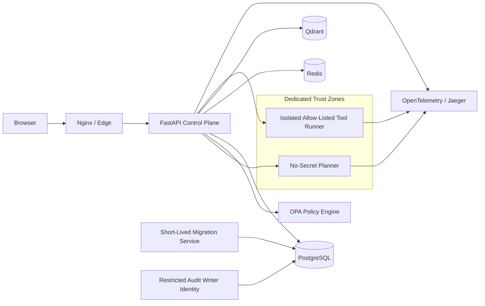

# Aurelian Autonomous Enterprise Operations

**v0.3.5.2 — six-review resilience/network-hardening candidate**  
**The Aurelian Group · Flagship Public Technical Demonstration**

A production-shaped demonstration of governed autonomous enterprise operations: signed identity, tenant-isolated data, externalized policy, human approval, just-in-time reauthorization, durable execution receipts, request/execution idempotency, crash-recovery detection, no-secret planning, isolated allow-listed tool execution, separated database duties, authenticated internal data services, hybrid retrieval, distributed tracing, and cryptographically verifiable audit evidence.

> **All products, customers, orders, incidents, identities and financial values are synthetic demo data. This repository demonstrates architecture and controls; it does not claim a client production deployment or compliance certification.**

## Security architecture



### Explicit trust boundaries

- **Control-plane API** receives signed identity and owns orchestration, but does not receive the database-admin credential.
- **Planner** parses untrusted requests on a dedicated internal network with **no mounted secrets, no database access and no external egress**.
- **Tool runner** accepts only finite allow-listed tool names. It runs as UID 10001, read-only, with all Linux capabilities dropped, `no-new-privileges`, PID/memory/CPU limits, and a dedicated Docker network that cannot see PostgreSQL, Redis, Qdrant or OPA.
- **Database migration/bootstrap** runs as a short-lived separate service with the admin credential. The API runtime identity cannot perform DDL.
- **Audit writes** use `aurelian_audit_writer`, separate from `aurelian_app`.
- **PostgreSQL RLS** uses transaction-local tenant state and pooled connections are sanitized with `DISCARD ALL` before reuse.

## Governed execution lifecycle

`INPUT_GUARD → PLAN → POLICY → WAIT_APPROVAL / JIT_POLICY → EXECUTE → VERIFY → COMPLETE`

Important properties:

- unregistered actions default deny;
- configured OPA failure is **fail-closed**;
- side-effecting prompt-injection signals are blocked;
- high-risk writes require executive+MFA approval;
- approval execution performs a **fresh OPA evaluation immediately before the tool call**;
- approval rows are claimed with an atomic `pending → executing` compare-and-set;
- tool executions receive deterministic durable execution keys and receipts before side effects;
- side-effect operations are not blindly retried after ambiguous failures; indeterminate outcomes become `recovery_required`;
- startup reconciliation detects stale `executing` approvals/executions/compensations and orphaned `CREATED` tasks;
- `POST /api/tasks` supports actor-scoped `Idempotency-Key` replay protection;
- reversible operations record validated compensation metadata and rollback claims occur before compensation execution.

## Database separation of duties

The Docker stack uses three distinct PostgreSQL responsibilities:

- `aurelian_admin` — bootstrap/migration only;
- `aurelian_app` — runtime application DML, `NOSUPERUSER`, `NOBYPASSRLS`, no schema `CREATE`, and **no audit INSERT/UPDATE/DELETE/TRUNCATE**;
- `aurelian_audit_writer` — `SELECT + INSERT` on `audit_events` only, also `NOSUPERUSER` and `NOBYPASSRLS`.

The audit table is owned by the admin/migration identity. Runtime identities cannot disable its trigger, alter it, truncate it or rewrite prior events.

## RAG and untrusted content

- hybrid sparse+dense retrieval;
- Qdrant vector-store integration;
- authenticated Redis query cache with bounded in-process fallback;
- Qdrant API-key authentication;
- tenant/environment/service/trust metadata filters;
- confidence thresholds;
- high-risk prompt-injection content is automatically quarantined from the trusted retrieval set even when submitted as `trusted`;
- the public demo uses a deterministic encoder to remain reproducible and API-key free.

The current public demo **does not execute arbitrary LLM-generated code and does not expose a generic outbound HTTP tool**. Future live-model adapters should remain in a no-secret/no-egress planner boundary rather than moving model execution into the control-plane process.

## Secret handling

The full Docker deployment sources application/runtime secrets from Compose secrets and mounts them under `/run/secrets`. Universal working demo JWT, audit-signing, and internal-service-token literals are no longer shipped in executable source. Redis authentication is secret-file based for clients/server; Qdrant server authentication is enabled with an API key and the API client reads its key from a mounted secret.

The API receives only the runtime secrets it needs. It never receives `POSTGRES_ADMIN_PASSWORD`. The planner receives **no secrets at all**.

## Distributed tracing

W3C Trace Context is propagated across:

`browser → Nginx → FastAPI → planner/tool-runner → Jaeger`

Named services include:

- `aurelian-control-plane-api`
- `aurelian-planner`
- `aurelian-tool-runner`

The API returns `X-Aurelian-Trace-ID`, and SSE workflow events include the active trace ID where available.

## Audit evidence

Audit events use:

- SHA-256 hash chaining;
- HMAC-SHA256 signatures;
- tenant-scoped chain validation;
- advisory transaction locks to prevent concurrent hash-chain forks;
- restricted audit-writer DB privileges.

Raw user prompts are **not** copied into audit payloads or execution-checkpoint state. The system records prompt hashes, lengths and derived risk metadata instead.

## Full local stack

Requirements: Docker Desktop / Docker Engine + Compose.

Generate a local `.env` with independent random values for all eight required local-stack secrets in `.env.example`, then:

```bash
docker compose down -v
docker compose up --build -d
docker compose ps
```

Open:

- Operations console: `http://localhost:8080`
- Jaeger: `http://localhost:16686`

The Compose topology contains:

1. frontend / Nginx
2. control-plane API
3. no-secret planner
4. migration service (short-lived)
5. isolated tool runner
6. PostgreSQL
7. Redis
8. Qdrant
9. OPA
10. Jaeger

## Test and assurance suite

```bash
pip install -r requirements-dev.txt
pytest -q
```

Current portable static/local verification: **36/36 tests passing**. This does **not** substitute for the configured live Docker/PostgreSQL/OPA integration job.

Tests include:

- workflow checkpointing and JIT-policy execution;
- executive+MFA approval gating;
- approval replay protection;
- prompt-injection side-effect blocking;
- poisoned-RAG quarantine;
- tenant isolation;
- tool-runner arbitrary-code endpoint rejection;
- tool timeout/retry/fail-safe behavior;
- business-state invariance after denied/failed requests;
- raw prompt-marker exclusion from audit/checkpoint telemetry;
- audit-chain tamper detection;
- compensation single-use protection;
- Docker network isolation assertions, including frontend/backend segmentation;
- request/execution idempotency and ambiguous side-effect recovery behavior;
- compensation poisoning rejection;
- proof that the API does not receive the PostgreSQL admin secret;
- configuration assertions for Redis/Qdrant authentication and production demo-token disablement.

GitHub Actions additionally defines Bandit SAST, `pip-audit`, secret-pattern scanning, Compose validation, a **runtime-security-integration** job for PostgreSQL RLS/network/service-auth/OPA fail-closed checks, and executable/test-code SHA-256 artifact generation.

## Production profile boundary

The default `docker-compose.yml` remains an explicitly synthetic public demo and sets `PUBLIC_DEMO=true`. For a production-shaped deployment, layer `docker-compose.production.yml` on top; it sets `PUBLIC_DEMO=false` at process start and requires external OIDC configuration, so the demo-token route is not registered.

```bash
docker compose -f docker-compose.yml -f docker-compose.production.yml up --build -d
```

Production still requires environment-specific TLS/mTLS, external secret/KMS policy, monitoring, backup, and deployment review; this repository does not claim those controls have been independently audited.

## Reviewer documents

- `ADVERSARIAL_REMEDIATION_v3.5.md`
- `SECURITY_AND_GOVERNANCE.md`
- `docs/ARCHITECTURE.md`
- `docs/THREAT_MODEL.md`
- `PEER_REVIEW_PROMPT.md`
- `VERIFICATION_REPORT.md`

## Design thesis

> **Models may propose. Identity, policy, just-in-time authorization, isolation, human authority and evidence determine what becomes real.**

---

**The Aurelian Group**  
Advanced Technology & Intelligent Systems Engineering
