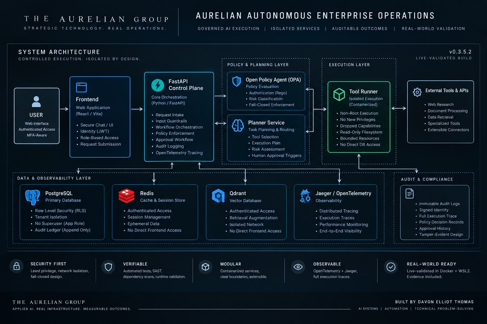
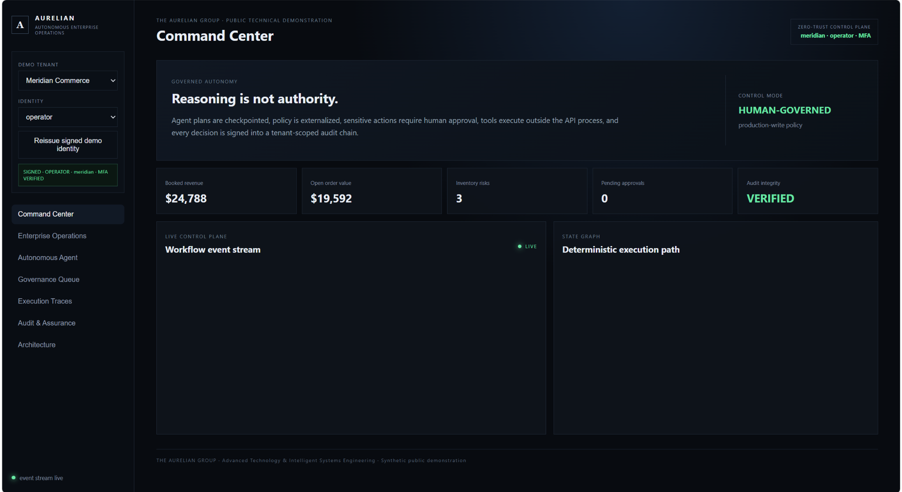
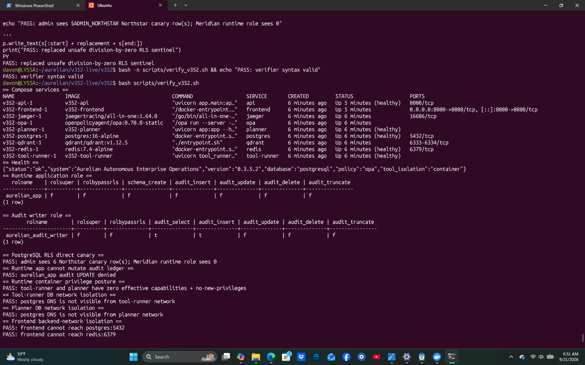
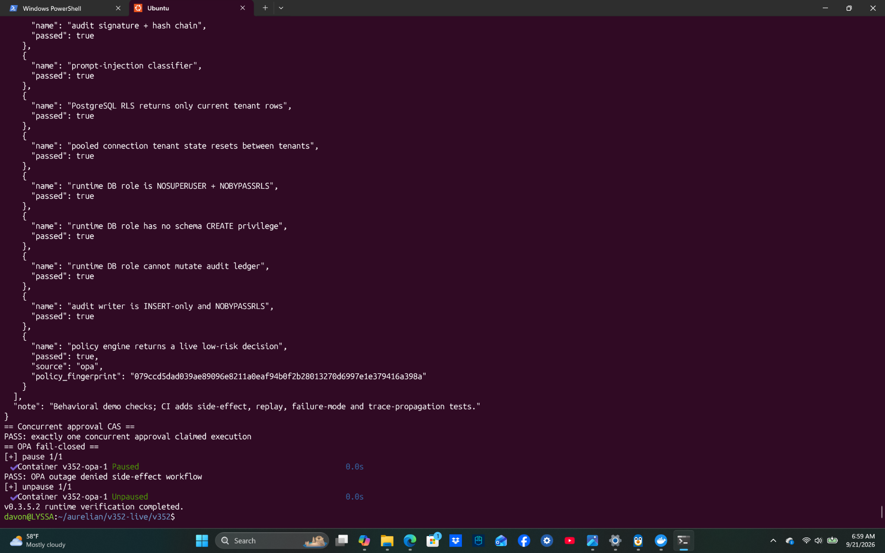
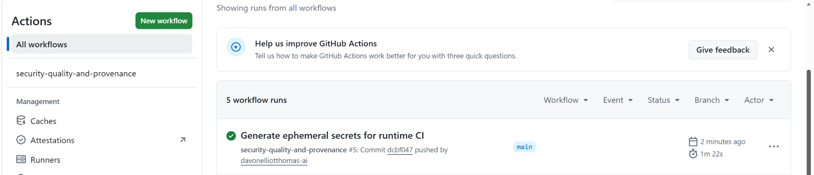
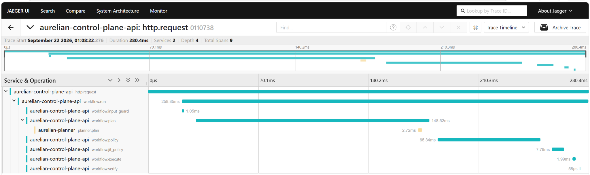

# Aurelian Autonomous Enterprise Operations

**A runtime-validated governed autonomous operations platform demonstrating policy-controlled execution, tenant isolation, approval workflows, audit integrity, distributed observability, and isolated service execution.**

Built by **Davon Elliot Thomas** under **The Aurelian Group**.

---

## What This Demonstrates

Aurelian Autonomous Enterprise Operations is a production-style engineering demonstration of how AI-assisted and autonomous workflows can perform operational actions without giving an agent unrestricted control over production systems.

The validated build demonstrates:

- multi-service AI workflow orchestration
- risk-based policy enforcement with Open Policy Agent
- MFA-aware human approval for high-risk actions
- just-in-time authorization before execution
- real PostgreSQL state mutation through governed workflows
- PostgreSQL Row Level Security and tenant isolation
- restricted planner and tool-execution services
- authenticated Redis and Qdrant access
- fail-closed behavior during policy-engine failure
- hash-linked signed audit records
- concurrency protection for approval execution
- prompt-injection controls
- OpenTelemetry distributed tracing across services
- automated runtime and security verification

The engineering objective is not merely to make an autonomous system act.

It is to make its actions **governed, observable, attributable, and testable**.

---

## Architecture



*System architecture overview for Aurelian Autonomous Enterprise Operations v0.3.5.2.*

---

## Technology Stack

### Application
- Python
- FastAPI
- Pydantic
- asyncpg

### Data
- PostgreSQL
- Redis
- Qdrant

### Policy & Identity
- Open Policy Agent (OPA)
- JWT-based identity
- role and scope authorization
- MFA-aware approval paths

### Infrastructure
- Docker
- Docker Compose
- isolated service networks
- file-backed runtime secrets

### Observability
- OpenTelemetry
- Jaeger
- structured execution traces

### Assurance
- pytest
- Bandit SAST
- pip-audit
- GitHub Actions
- runtime integration verification

---

## Governed Execution Model

```text
Request
   ↓
Identity Verification
   ↓
Input / Injection Guard
   ↓
Planning
   ↓
Policy Evaluation
   ↓
Risk Classification
   ↓
Approval Gate
   ↓
Just-in-Time Authorization
   ↓
Isolated Tool Execution
   ↓
Verification
   ↓
Audit + Trace
```

Higher-risk operations require stronger authorization than read-only or lower-risk operations.

The platform also implements concurrency controls designed to prevent multiple approval requests from claiming the same execution.

---

## Security and Isolation

### PostgreSQL

The runtime application role is configured without superuser or RLS-bypass privileges.

```text
NOSUPERUSER
NOBYPASSRLS
```

The application role does not receive schema-creation privileges and cannot mutate the audit ledger.

PostgreSQL Row Level Security is used for tenant isolation.

Live runtime verification exercised this using cross-tenant canary records.

### Audit Writer

A separate audit-writer identity is restricted to audit append operations and cannot update or delete existing audit records.

Audit events include previous-event hashes, event hashes, and signatures. Runtime verification confirmed continuous hash-chain linkage across the tested governed workflow.

### Tool Execution

The tool runner uses a restricted container posture including:

- non-root execution
- dropped Linux capabilities
- `no-new-privileges`
- read-only filesystem controls
- bounded resources

The tool runner is also isolated from the PostgreSQL network.

### Network Segmentation

Runtime verification demonstrated that:

- the tool runner cannot resolve PostgreSQL
- the planner cannot resolve PostgreSQL
- the frontend cannot directly reach PostgreSQL
- the frontend cannot directly reach Redis
- the frontend cannot directly reach Qdrant
- the frontend cannot directly reach OPA

### Service Authentication

Redis and Qdrant require authenticated access.

Runtime credentials are not committed to this public repository.

GitHub Actions generates temporary secrets for runtime CI and destroys them with the runner.

---

## Fail-Closed Behavior

Security-sensitive paths are designed to fail closed.

Example:

```text
OPA available
→ policy decision evaluated
→ permit or deny

OPA unavailable
→ side-effect workflow denied
```

Runtime validation deliberately made OPA unavailable and confirmed that a state-changing workflow was denied rather than executed.

The sandbox worker also terminates if required resource limits cannot be established rather than continuing execution without those controls.

---

## Governed State-Change Proof

The validated workflow exercised a real high-risk product-price mutation.

Before execution:

```text
AUR-101 | NovaEdge Pro Hub | $1,299
```

The request passed through:

```text
policy.decision
→ approval.requested
→ approval.claimed
→ policy.jit_recheck
→ tool.executed
→ approval.executed
```

After the authorized execution:

```text
AUR-101 | NovaEdge Pro Hub | $997
```

The resulting events were recorded in the signed, hash-linked audit chain.

A separate fail-closed test demonstrated that the same class of state-changing action was denied when the policy engine was unavailable.

---

## Testing and Validation

The current public repository passes its GitHub Actions pipeline.

Current checks include:

```text
✓ Python compilation
✓ 36 automated tests
✓ Bandit static security analysis
✓ dependency vulnerability audit
✓ secret-pattern checks
✓ Docker Compose validation
✓ runtime security integration
```

The runtime CI lane exercises the actual container topology rather than relying exclusively on mocked or SQLite-based behavior.

---

## Live Validation

A frozen engineering build of **v0.3.5.2** was executed and validated in a Docker Desktop + WSL2 environment.

Observed validation included:

- clean Docker bootstrap
- database migration completion
- PostgreSQL role separation
- PostgreSQL RLS isolation
- audit mutation denial
- container privilege checks
- network segmentation
- Redis authentication
- Qdrant authentication
- live OPA policy decisions
- concurrent approval CAS behavior
- OPA outage fail-closed behavior
- governed PostgreSQL state mutation
- audit hash-chain linkage
- cross-service distributed tracing

Validation evidence is preserved under:

```text
runtime-evidence/
```

---

## Runtime Evidence

The following screenshots are direct evidence from the running v0.3.5.2 system and its current CI pipeline.

### Operational Interface



*Actual Aurelian interface from the running system.*

### Docker Runtime and Security Controls



*Containerized v0.3.5.2 runtime and security-validation evidence from Docker Desktop + WSL2.*

### Automated Runtime Verification



*Completed v0.3.5.2 runtime verification, including concurrency and fail-closed policy behavior.*

### GitHub Actions CI



*Public repository CI completing successfully after testing, security scanning, Compose validation, and runtime integration checks.*

### Distributed Trace — v0.3.5.2



*Actual Jaeger/OpenTelemetry evidence showing trace-context propagation across the Aurelian control-plane API and planner service, with workflow spans covering input guarding, planning, policy evaluation, and governed execution.*

---

## Adversarial Review

The architecture went through multiple adversarial review and remediation passes covering:

- compensation race conditions
- tenant isolation
- policy provenance
- audit-chain construction
- prompt-injection handling
- secret management
- network segmentation
- database privileges
- approval concurrency
- CI assurance quality

Review findings resulted in implementation and architecture changes before the validated build was frozen.

---

## Repository Status

```text
Public source repository        ✓
GitHub Actions CI               ✓
Automated test suite            ✓
Static security analysis        ✓
Dependency vulnerability scan   ✓
Runtime integration tests       ✓
Local live validation           ✓
Runtime evidence captured       ✓
```

---

## Engineering Areas Demonstrated

This project demonstrates work relevant to:

- applied AI engineering
- agentic systems
- backend engineering
- secure workflow execution
- business automation
- systems integration
- internal tools
- AI platform engineering
- distributed systems
- technical architecture

---

## Author

**Davon Elliot Thomas**

**The Aurelian Group**

Focused on AI systems, software engineering, automation, secure autonomous workflows, and advanced technical problem-solving.

---

## Technical Claim Boundary

This repository is an engineering demonstration, not a third-party security certification.

The validated build demonstrates behavior observed in the tested environment; it should not be interpreted as proof that the system is free from every possible vulnerability.

Portions of planning and execution use deterministic and controlled components. The project does not claim that a paid external LLM autonomously drives every workflow.

The focus of the project is the surrounding engineering required to make autonomous operations **governable, observable, attributable, and testable**.
