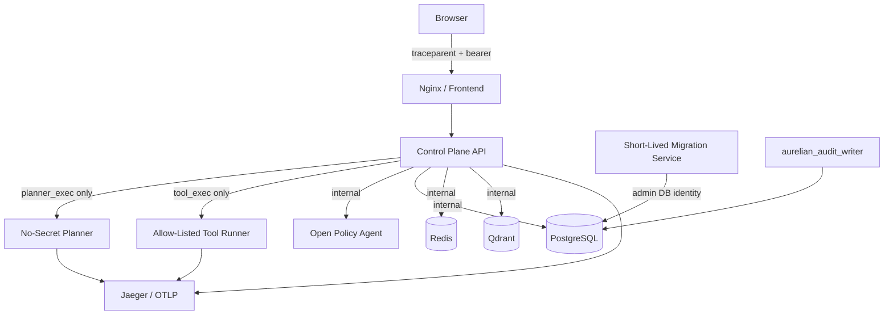
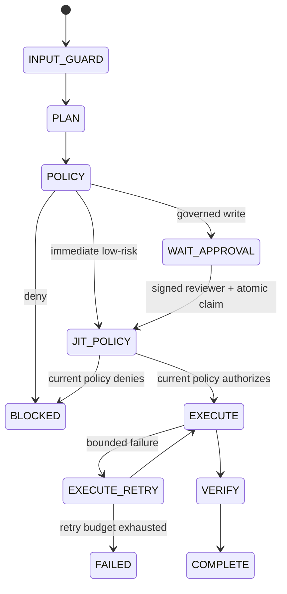

# Architecture — Aurelian Autonomous Enterprise Operations v0.3.5

## Container topology

## Network topology

- `edge`: frontend + Jaeger localhost UI path
- `internal` (`internal: true`): API, PostgreSQL, Redis, Qdrant, OPA, migration service, Jaeger
- `tool_exec` (`internal: true`): API, tool runner, Jaeger only
- `planner_exec` (`internal: true`): API, planner, Jaeger only

The tool runner and planner therefore have no Docker network path to PostgreSQL and no route to the public Internet.

## Data-plane transaction boundary

Each runtime PostgreSQL operation opens an explicit transaction and sets `app.tenant_id` transaction-locally. `DISCARD ALL` runs on pool reset before connection reuse.

## Control-plane execution

## Observability topology

W3C Trace Context flows from the browser into the API. The API injects active context into planner/tool-runner calls. Downstream services extract that context and create child spans, allowing a single Jaeger trace to correlate user request → planning → control plane → isolated execution.
